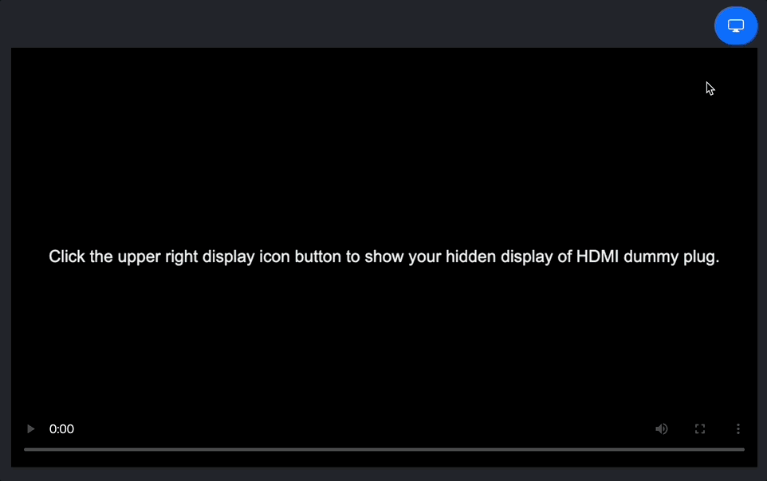

# ShowMeDummy

ShowMeDummy is a super simple web application for checking the desktop display using an HDMI dummy plug.

## Overview

This web app allows you to show the desktop display using an HDMI dummy plug. It enables you to test dual monitor setups and verify display settings during presentations.

## Features

- Real-time simulation of the desktop display
- Testing dual monitor setups
- Verifying display settings during presentations

## Usage

1. Connect the HDMI dummy plug to your computer.
2. Open [ShowMeDummy](https://tetsuakibaba.github.io/ShowMeDummy/) with Chrome browser
3. Click the display button to show the desktop display.

## License

ShowMeDummy is provided under the MIT license.

## Contribution

We welcome contributions to improve ShowMeDummy! If you would like to contribute, please follow these steps:

1. Fork the ShowMeDummy repository.
2. Create a new branch for your feature or bug fix.
3. Make your changes and commit them to your branch.
4. Push your branch to your forked repository.
5. Open a pull request to the main ShowMeDummy repository.

Please ensure that your code follows our coding conventions and includes appropriate tests. We appreciate your contributions!

